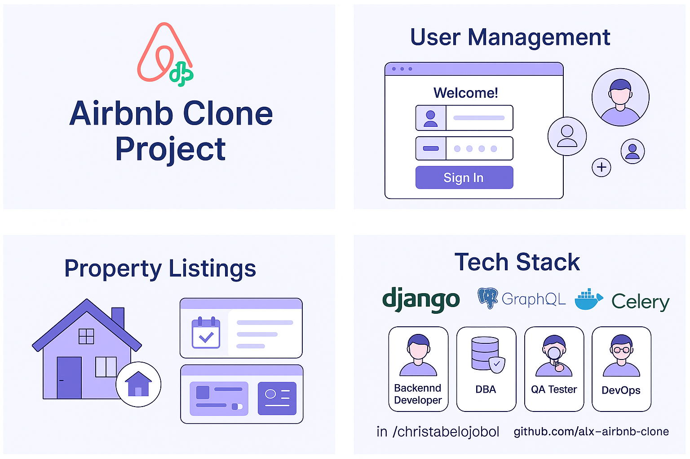

# AirBnB Clone Project

## 🌍 Overview

The **AirBnB Clone Project** is a comprehensive full-stack web application inspired by the popular property rental platform, AirBnB. It was developed to simulate real-world software engineering practices, focusing on robust backend architecture, secure APIs, optimized databases, and modern DevOps workflows. This project showcases the collaborative effort of a cross-functional engineering team and highlights our ability to build a scalable and secure property booking platform.

---

## 🎯 Objectives

- Implement secure and scalable user authentication and authorization
- Enable full CRUD functionality for property listings and bookings
- Integrate real-time payment processing
- Build a review and rating system for quality assurance
- Optimize data performance with caching and indexing strategies

---

## 🛠️ Tech Stack

| Layer        | Technology                        |
|--------------|-----------------------------------|
| Backend      | Django, Django REST Framework     |
| Database     | PostgreSQL                        |
| APIs         | RESTful API, GraphQL              |
| Asynchronous Tasks | Celery                      |
| Caching      | Redis                             |
| Containers   | Docker                            |
| CI/CD        | GitHub Actions, Docker Compose    |

---

## 👥 Team Responsibilities

This project was built through team collaboration across multiple engineering roles. Each role played a critical part in the overall development lifecycle.

### 🔹 Backend Developer  
Designed and implemented RESTful and GraphQL APIs, business logic, and integrations with third-party services such as payment providers. Ensured code scalability, maintainability, and testing coverage.

### 🔹 Database Administrator (DBA)  
Crafted and managed PostgreSQL schemas, ensured referential integrity, optimized performance through indexing and query tuning, and handled data migrations.

### 🔹 DevOps Engineer  
Managed containerized development using Docker, orchestrated CI/CD pipelines with GitHub Actions, automated deployment, and ensured seamless production delivery.

### 🔹 QA Engineer  
Led quality assurance by writing test cases, performing functional, integration, and regression tests. Monitored bug resolution and verified production readiness.

---

## ⚙️ Key Technologies Explained

- **Django**: Robust Python framework useful used to develop the backend logic and data models  
- **Django REST Framework (DRF)**: Extends Django for building clean and powerful RESTful APIs  
- **PostgreSQL**: Advanced open-source relational database system  
- **GraphQL**: Allows clients to fetch precise data, reducing over-fetching  
- **Celery**: Executes background tasks like emails and notifications  
- **Redis**: Used for caching and speeding up repeated data queries  
- **Docker**: Containerizes the app for consistent local and cloud deployments  
- **GitHub Actions**: Automates testing, linting, and deployment tasks

---

## 🗃️ Database Schema Overview

### 1. `User`
- `id`  
- `username`  
- `email`  
- `password_hash`  
- `is_host`  

**Relation**: Users can own properties and make bookings.

### 2. `Property`
- `id`  
- `owner_id` (FK → User)  
- `title`  
- `description`  
- `location`  

**Relation**: Properties are listed by hosts and reviewed/booked by users.

### 3. `Booking`
- `id`  
- `user_id` (FK → User)  
- `property_id` (FK → Property)  
- `check_in_date`  
- `check_out_date`  

**Relation**: Bookings link users with properties and trigger payments.

### 4. `Payment`
- `id`  
- `booking_id` (FK → Booking)  
- `amount`  
- `payment_status`  
- `payment_date`  

**Relation**: Each booking has an associated payment.

### 5. `Review`
- `id`  
- `user_id` (FK → User)  
- `property_id` (FK → Property)  
- `rating`  
- `comment`  

**Relation**: Users can rate and review properties after their stay.

---

## 🚀 Feature Highlights

### ✅ User Authentication  
- Registration & login (JWT-based)  
- Profile roles: Guest or Host  
- Secure password hashing

### ✅ Property Management  
- Hosts can create, edit, and delete listings  
- Location-based search and filtering

### ✅ Booking Engine  
- Real-time booking availability  
- Conflict prevention on overlapping dates

### ✅ Payment Integration  
- Process and confirm payments securely  
- Payment status tracking per booking

### ✅ Review System  
- Star rating (1–5) and text feedback  
- Display average ratings on listings

### ✅ Developer-Friendly API Docs  
- REST and GraphQL API auto-generated documentation  
- Swagger & GraphiQL interfaces included

---

## 🔐 API Security Highlights

### 1. **Authentication (JWT)**  
Only authenticated users can access sensitive endpoints.

### 2. **Role-Based Access Control**  
Different permissions for Guests, Hosts, and Admins.

### 3. **Rate Limiting**  
Prevents abuse and denial-of-service attempts.

### 4. **Data Encryption**  
All sensitive data is encrypted during transmission (HTTPS) and securely stored.

---

## 🔄 CI/CD Pipeline

Automated testing and deployment enhance productivity and reduce errors.

### 🧰 Tools Used:
- **GitHub Actions**: Linting, unit tests, integration tests  
- **Docker Compose**: Multi-container orchestration for services  
- **PostgreSQL Service**: For testing and staging environments  

---

## 📌 Conclusion

This AirBnB Clone demonstrates the architecture, security, and features required for modern full-stack applications. It also showcases our ability to work collaboratively, write clean and scalable code, and deploy robust systems in a real-world simulation.

---

## 👤 Contributors 
**Christabel E. Ojobolo**  
- 🌐 [GitHub: Chrissie22](https://github.com/Chrissie22)  
- 💼 [LinkedIn: Christabel E. Ojobolo](https://www.linkedin.com/in/christabel-ojobolo)